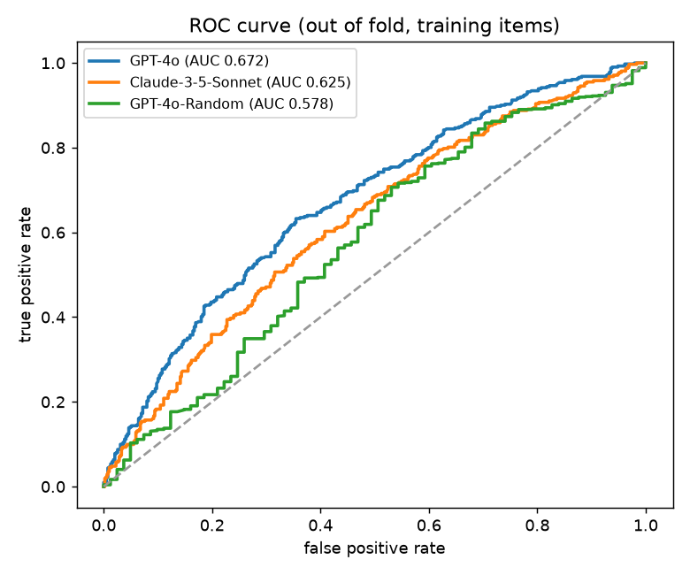
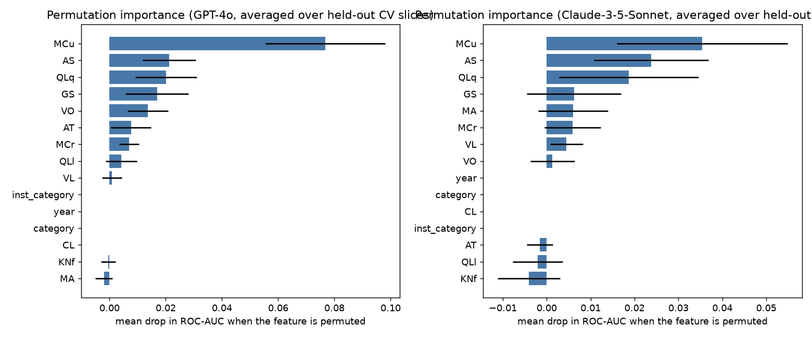
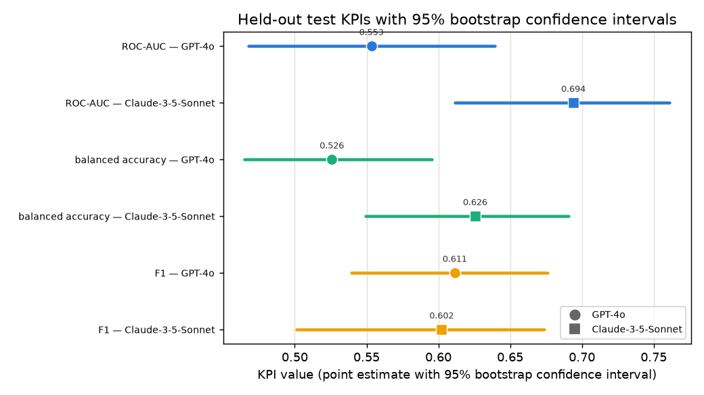

# CharXiv: Predicting Whether a VLM Will Read a Chart Correctly

This project uses the [CharXiv](https://charxiv.github.io/) benchmark, one thousand validation charts
drawn from arXiv papers with one reasoning question each, to ask whether we can predict when a
vision-language model answers a chart-reasoning item correctly. Every item carries a twelve-dimension
DeLeAn cognitive-demand profile that scores how much each dimension the item demands from zero to five,
independently of any model, and CharXiv ships pre-graded correctness for many models. Both sides live in
`charxiv_scoring/annotations_charxiv.db`; see [charxiv_scoring/README.md](charxiv_scoring/README.md) for
how that database was built.

The one-command reproduction is `bash run.sh` for the training side, and a one-page write-up of the
results is in [executive_summary.md](executive_summary.md).

## Table of contents

- [Problem statement](#problem-statement)
- [The twelve demand dimensions](#the-twelve-demand-dimensions)
- [Repository structure](#repository-structure)
- [Notebook walkthrough, Checkpoints 1 to 5](#notebook-walkthrough-checkpoints-1-to-5)
  - [Checkpoint 1, baseline and KPIs, notebook 11](#checkpoint-1-baseline-and-kpis-notebook-11)
  - [Checkpoint 2, EDA and feature selection, notebooks 12 to 14](#checkpoint-2-eda-and-feature-selection-notebooks-12-to-14)
  - [Checkpoint 3, evaluation framework, notebook 15](#checkpoint-3-evaluation-framework-notebook-15)
  - [Checkpoint 4, modeling, notebooks 16 to 19](#checkpoint-4-modeling-notebooks-16-to-19)
  - [Checkpoint 5, final results, notebook 20](#checkpoint-5-final-results-notebook-20)
- [Headline results](#headline-results)
- [What drives failure](#what-drives-failure)
- [Held-out test and split sensitivity](#held-out-test-and-split-sensitivity)
- [The final model and how to reproduce it](#the-final-model-and-how-to-reproduce-it)
- [Environment](#environment)

## Problem statement

For each of three target models, GPT-4o, Claude-3-5-Sonnet, and GPT-4o-Random, we predict whether it
answers a given CharXiv reasoning item correctly, and we test whether the DeLeAn demand profile adds
predictive value over a cheap metadata baseline. Each target has its own classifier. The positive class
is failure, so a label of one means the model got the item wrong. All modeling uses the eight-hundred-item
training split; the two-hundred-item test set stays sealed until the final evaluation.

GPT-4o-Random is a random-answer control that fails about ninety percent of items. It is the negative
control for the reasoning-demand signal, because the cognitive demand of an item cannot predict a random
answer. The item metadata, meaning `category`, `inst_category`, and `year`, is the cheap baseline that the
engineered demand features must beat. No model's correctness is ever used as a feature, the answer itself
is never predicted, and the four-part descriptive task is out of scope. See [kpis.md](kpis.md),
[evaluation_plan.md](evaluation_plan.md), and [modeling_plan.md](modeling_plan.md) for the KPI, evaluation,
and modeling specifications.

## The twelve demand dimensions

The engineered features are the twelve DeLeAn cognitive-demand dimensions, each scored from zero to five
by a verdict-blind process that sees only the question and the figure. Nine are standard DeLeAn dimensions
and three, marked below, are figure-grounding dimensions authored in-house. The dimension `CL` is dropped
from the model because it is near-constant, leaving eleven active features.

| Code | Name | Code | Name |
| --- | --- | --- | --- |
| VL | Visual Localization (new) | AT | Atypicality |
| AS | Attention and Scan | GS | Gestalt and Shape (new) |
| MCr | Identifying Relevant Information | QLl | Logical Reasoning |
| MCu | Calibrating Knowns and Unknowns | KNf | Formal Sciences |
| MA | Multi-Element Visual Aggregation (new) | QLq | Quantitative Reasoning |
| VO | Volume | CL | Conceptualisation and Learning (dropped) |

## Repository structure

```text
.
├── charxiv_scoring/          # Data layer: DeLeAn annotation pipeline + released-correctness DB
│   ├── annotations_charxiv.db                 #   SQLite: item(1000), annotation(1000x12 dims), model_score
│   ├── build_db.py items.py scores.py db.py   #   build and parse the database
│   ├── prepare.py collect_cli.py scrape.py    #   demand-annotation pass (isolated Sonnet subagents)
│   └── rubrics/                               #   the DeLeAn rubric definitions
├── charxiv_analysis/         # shared loaders + the cached 800/200 split (read by src/)
│   ├── mann_whitney_analysis.py  #   loaders: load_rubric, load_correctness, make_or_load_split
│   └── train_test_split.json     #   cached 800/200 split (seed 20260618)
├── src/                      # Reusable modeling code
│   ├── features/                 #   preprocessing.py, transformers.py, build_schema.py
│   ├── splits/                   #   splitters.py (paper-grouped item_holdout cross-validation)
│   ├── eval/                     #   core.py (grouped cross-validation runner), stress_tests.py, bootstrap.py
│   └── models/                   #   registry.py, tune.py, train.py, interpret.py
├── notebooks/                # CharXiv notebooks 11 through 20 
├── results/                  # cross-validation metric tables, EDA, stress-test outputs, and results/final/
├── artifacts/                # the serialized final per-target models and thresholds
├── presentation/             # slide deck for final presentation
├── tests/                    # test_pipeline.py, test_splits.py, test_models.py, test_bootstrap.py
├── project_checkpoints/      # the five checkpoint guides
├── docs/                     # developer logs and the superpowers plans and specs
├── prior_analyses/           # earlier SciVer and SciClaimEval work
├── rubric_scoring/           # older rubric development work
├── README.md  executive_summary.md  kpis.md  evaluation_plan.md  modeling_plan.md
└── requirements.txt  pyproject.toml  run.sh
```

## Notebook walkthrough, Checkpoints 1 to 5

The CharXiv work runs from notebook 11 to notebook 20, one section per checkpoint. Notebooks 11 through 16
and 20 run in the `.venv` environment, and notebooks 17 through 19 run in the heavier `charxiv-model` conda
environment described under [Environment](#environment).

### Checkpoint 1, baseline and KPIs, notebook 11

[notebooks/11_charxiv_baseline.ipynb](notebooks/11_charxiv_baseline.ipynb) fixes the key performance
indicators and establishes the metadata baseline. The primary indicator is ROC-AUC, chosen because it is
threshold-free and invariant to the class balance, which matters because the failure base rate ranges from
about 0.39 for Claude-3-5-Sonnet to about 0.90 for GPT-4o-Random. Balanced accuracy and F1 are the
secondary indicators. The metadata baseline is weak for the two real models, near 0.53 ROC-AUC, which sets
a low bar for the demand dimensions to clear.

### Checkpoint 2, EDA and feature selection, notebooks 12 to 14

[notebooks/12_charxiv_eda.ipynb](notebooks/12_charxiv_eda.ipynb) explores the demand annotations and the
correctness labels. [notebooks/13_charxiv_feature_selection.ipynb](notebooks/13_charxiv_feature_selection.ipynb)
makes the two feature decisions that carry through the project, dropping the near-constant `CL` dimension
and keeping the item metadata only as a baseline rather than as a live feature.
[notebooks/14_charxiv_pipeline_demo.ipynb](notebooks/14_charxiv_pipeline_demo.ipynb) demonstrates the
preprocessing pipeline that turns the database into a per-item design matrix.

### Checkpoint 3, evaluation framework, notebook 15

[notebooks/15_charxiv_metric_evaluation.ipynb](notebooks/15_charxiv_metric_evaluation.ipynb) builds the
evaluation harness, including the paper-grouped cross-validation that keeps every figure from a given
paper on one side of a fold, the repeated folds that give each metric a mean and a standard deviation, and
the stress tests. This is the framework that every later notebook scores against.

### Checkpoint 4, modeling, notebooks 16 to 19

[notebooks/16_charxiv_modeling_baselines.ipynb](notebooks/16_charxiv_modeling_baselines.ipynb) sets
trivial and simple reference points per target, and
[notebooks/17_charxiv_modeling_experiments.ipynb](notebooks/17_charxiv_modeling_experiments.ipynb) tunes
four richer families, a regularized logistic regression, a random forest, a histogram gradient boosting
model, and XGBoost, under nested paper-grouped cross-validation. None beats the plain logistic regression,
and the tree models drift toward very shallow depth, which points to a ceiling in the signal rather than in
the model family. [notebooks/18_charxiv_bootstrap_stability.ipynb](notebooks/18_charxiv_bootstrap_stability.ipynb)
and [notebooks/19_charxiv_tabpfn_check.ipynb](notebooks/19_charxiv_tabpfn_check.ipynb) confirm that reading
with a bootstrap stability check and a TabPFN flexibility check.

### Checkpoint 5, final results, notebook 20

[notebooks/20_charxiv_final_results.ipynb](notebooks/20_charxiv_final_results.ipynb) tells the story end to
end, from the database through feature selection, the train and validation setup, the choice of model
family, the tuning of the final logistic regressions, and the one-time held-out evaluation. It is the
single source for every table and figure under [results/final/](results/final), and it serializes the
three per-target models. The sealed two-hundred-item test set is read only inside a gated section that is
off by default, so a normal run never touches it. The presentation deck and speaking script in
[presentation/](presentation) draw entirely from this notebook.

## Headline results

The demand dimensions are a clear improvement over the metadata baseline for the two real models, and, as
the negative control requires, they add nothing for GPT-4o-Random, whose success is governed by the answer
format rather than the reasoning demand. The table below reports the cross-validated ROC-AUC under each
feature configuration.

| Target | Metadata baseline | Demand dimensions |
| --- | --- | --- |
| GPT-4o | 0.528 | 0.676 |
| Claude-3-5-Sonnet | 0.536 | 0.628 |
| GPT-4o-Random | 0.727 | 0.580 |

The cross-validated key performance indicators of the final per-target classifiers are below. The two real
models sit near 0.68 and 0.63, and the random control sits near chance, exactly as it should.

| Target | ROC-AUC | Balanced accuracy | F1 |
| --- | --- | --- | --- |
| GPT-4o | 0.676 | 0.631 | 0.650 |
| Claude-3-5-Sonnet | 0.628 | 0.567 | 0.379 |
| GPT-4o-Random | 0.580 | 0.500 | 0.947 |



## What drives failure

Because the final models are linear, their coefficients read directly as the contribution of each demand
dimension to the odds of failure. One dimension dominates for both real models, the demand to calibrate
what is known against what is unknown (`MCu`), which raises failure odds, while quantitative-reasoning
(`QLq`) and gestalt-shape (`GS`) demands lower them. The permutation-importance view below, averaged over
every held-out cross-validation slice, agrees with the coefficients.



## Held-out test and split sensitivity

The sealed test set was scored once, on the one hundred ninety-four items whose papers do not straddle the
item-level split. GPT-4o scored a ROC-AUC of 0.553, Claude-3-5-Sonnet 0.694, and the random control 0.588,
each reported with a bootstrap confidence interval. The GPT-4o result fell below its cross-validation
number, so notebook 20 resamples the split one hundred times and finds the original GPT-4o draw below the
second percentile and the Claude draw near the ninetieth, with no significant train and test imbalance
after a Holm adjustment. The gap is sampling variation in one small test set, and the cross-validation
figures, averaged over many folds, are the more reliable estimate.



## The final model and how to reproduce it

The chosen family is logistic regression for every target, the simplest strong and most interpretable
model, since no richer family justified its added cost. The three refit pipelines are serialized together
as a dictionary keyed by target in `artifacts/final_model.joblib`, and the balanced-accuracy decision
thresholds for the two real targets are in `artifacts/final_thresholds.json`.

Reproduce the training-side results with `bash run.sh`, which executes notebook 20 headless and never reads
the sealed test items. To additionally run the one-time held-out evaluation, use
`CHARXIV_EVAL_TEST=1 bash run.sh`. The test suite runs with
`.venv/bin/python -m pytest tests -q` and is skipped automatically if the database is absent.

## Environment

The project uses two environments. Most of the work runs in the repository virtual environment `.venv`;
the three heavier modeling notebooks, 17 through 19, run in a separate `charxiv-model` conda environment
that carries XGBoost, SHAP, and TabPFN. The database `charxiv_scoring/annotations_charxiv.db` is present in
the repository, so no data download is needed.

| Notebooks | Environment | Jupyter kernel | Notes |
| --- | --- | --- | --- |
| 11 to 16, 20; all `src/` code, the tests, and `run.sh` | `.venv` (repo root) | `charxiv` | scikit-learn 1.9, numpy 2.x |
| 17, 18, 19 | `charxiv-model` conda env | `charxiv-model` | Prefix every run with `KMP_DUPLICATE_LIB_OK=TRUE`; notebook 19 additionally needs `OMP_NUM_THREADS=1`, `MKL_NUM_THREADS=1`, and `TABPFN_ALLOW_CPU_LARGE_DATASET=1`, which its first cell already sets |

Setting up `.venv`, the default:

```bash
python -m venv .venv
.venv/bin/pip install -r requirements.txt
.venv/bin/python -m ipykernel install --user --name charxiv --display-name charxiv
```

Run every script and notebook in this environment with `.venv/bin/python`, never a bare `python`.

Setting up the `charxiv-model` conda environment, only for notebooks 17 through 19:

```bash
conda create -n charxiv-model python=3.12
conda run -n charxiv-model pip install -r artifacts/requirements_charxiv-model.txt
conda run -n charxiv-model python -m ipykernel install --user --name charxiv-model --display-name charxiv-model
```

A model pickled in the conda environment will not reload cleanly in `.venv` because the scikit-learn
versions differ, so notebook 20 writes the serialized final model in `.venv` and is the authoritative
writer.
