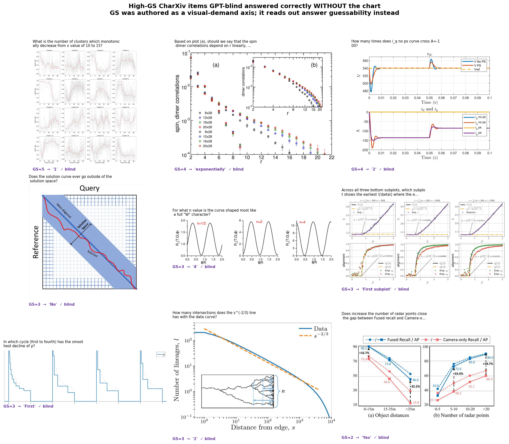
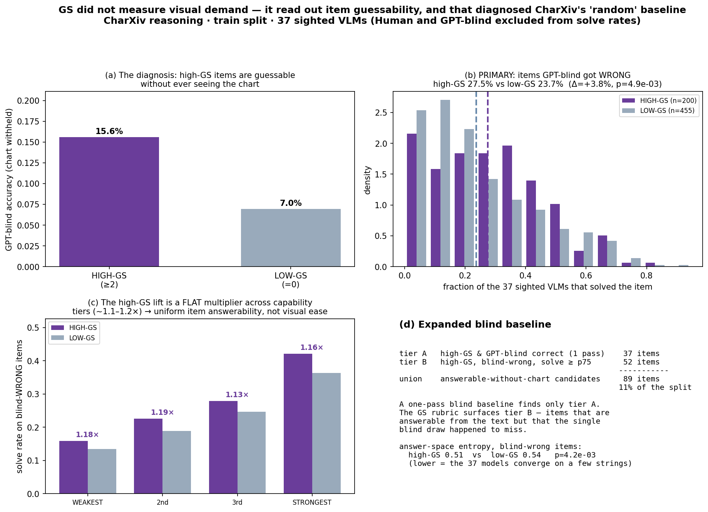
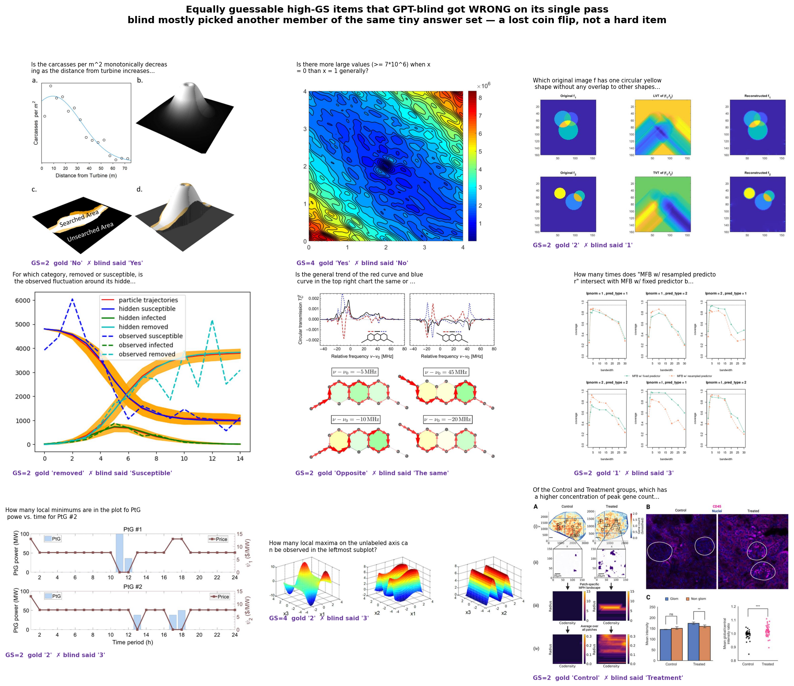

# GPT-blind is not random

A rubric dimension returned the opposite of the result we predicted. Following that anomaly showed
what the dimension was actually measuring — and diagnosed a baseline that a widely-used
chart-reasoning benchmark ships as "random."

> CharXiv reasoning task · 800-item train split (the 200 test items are untouched) · 39 models, solve
> rates over the 37 sighted VLMs excluding the `Human` ceiling and the blind baseline
>
> **GPT-blind** = CharXiv's `GPT-4o-Random`: GPT-4o answering the reasoning question with the chart
> image withheld
>
> Regenerate: `python charxiv_analysis/gs_guessability.py` · `python charxiv_analysis/gs_vs_mcu.py`

| | |
|---|---|
| **10.8%** | GPT-blind accuracy — not a floor, a measure of how often the question alone narrows the answer |
| **2.2×** | more guessable blind on high-GS items (15.6% vs 7.0%) |
| **89** | items answerable without the chart — 11.1% of the split |
| **ρ = 0.993** | leaderboard rank correlation if all 89 are removed |

---

## 1. What we expected, and what we got

We authored **GS (Gestalt & Shape Judgment)** as one of three in-house *figure-grounding* demand
dimensions, alongside VL (visual localization) and MA (multi-element aggregation). GS scores 0–5 how
much an item requires a holistic, non-pointwise impression of the data's *shape* — trend direction,
convexity, convergence to a plateau, cluster count — as opposed to reading off individual values.

A demand dimension has one defining behavior: **more demand should mean more failure.** Every other
dimension obeyed this. Across models, failed items demanded more VL, AS, MCr, MCu, MA, VO, AT.

GS went the other way. Items with **higher** GS were answered **more correctly**. The random forest
independently flagged GS as one of the two strongest predictors of per-item outcome (top-4 in 27 of
39 models), so it was carrying real signal.

**That is a pool-level result, and it does not describe the frontier.** For the two target models
this project predicts — GPT-4o and Claude-3-5-Sonnet — GS ranks 6th and 7th of twelve by mean
|SHAP|, with MCu leading both. The high-GS advantage tracks capability inversely: **+8.6** points
for GPT-blind, +4.4 for GPT-4o, +1.3 for Sonnet, +1.3 for `Human`. That gradient is the first clue
to what GS is really tracking.

## 2. What is GS measuring?

The result that made this diagnosable was not on any sighted model. It was on GPT-blind.

GS was the single strongest **protective** feature for GPT-blind too — a model answering with the
chart removed. A blind model cannot benefit from a chart being visually easier to parse. If GS were
measuring visual demand, its effect there should be nothing.

That reframes the question from *"why is a visual demand dimension protective?"* to *"what is GS
actually measuring, if a blind model can exploit it?"* Three lines of evidence answered it:

- **GS carries zero signal about how much seeing helps.** Per item, define the vision gain as
  GPT-4o correct − GPT-blind correct — the same model, image on vs off. Spearman(GS, gain) ≈
  **−0.01** against a mean gain of +0.39. Flat. The genuine visual dimensions are clearly negative
  over the same items (MCu −0.23, AS −0.17, VL −0.09, MA −0.075): sight pays off less on items that
  demand more vision, exactly as it should. **GS dissociates from VL and MA**, the two dimensions it
  was authored alongside.
- **High-GS items are 2.2× more guessable blind.** GPT-blind scores **15.6%** on GS ≥ 2 items vs
  **7.0%** on GS = 0 items.
- **The mechanism is answer-space size.** High-GS items have far fewer numeric answers (35% vs 53%)
  and skew to low-cardinality labels and shape words — "which subplot," "increasing or decreasing,"
  "linear or exponential," a curve name.

**GS is a readout for item answerability, not for visual demand.** The dimension works — it is
stable, reproducible, and one of the strongest item-level signals in the battery. It simply measures
a different property than the one it was authored to capture: not how hard an item is to *see*, but
how small the space of plausible answers is.

## 3. What that says about CharXiv's baseline

CharXiv ships `GPT-4o-Random` as a reference point implying a floor — the score you get without
looking. It scores **10.8%** overall (10.1% on our train split).

That is not a floor and it is not noise. Free-text answers with no fixed option set should be worth
approximately nothing. 10.8% is the rate at which **CharXiv reasoning questions can be answered from
their own text**, and GS tells you which items those are.

Nothing here is leaked. The gold answer never appears in the prompt, and no test information reaches
the model. The questions are simply **guessable**: many of them name their own candidate answers, or
imply a set small enough that a domain-competent language model can pick correctly without looking.
"Increasing or decreasing" has two options whether or not you see the chart. So the baseline is not
random — it is a measurement of how constrained CharXiv's answers are, and nobody had labelled it
that way.

These are high-GS items GPT-blind answered **correctly with the chart never shown**. Read the
question first:

| item | GS | question | gold | blind said |
|---|---|---|---|---|
| `charxiv_val_1555` | 3 | Does the solution curve ever go outside of the solution space? | `No` | `No` |
| `charxiv_val_219` | 2 | Does increasing the number of radar points close the gap between Fused recall and Camera-only…? | `Yes` | `Yes` |
| `charxiv_val_1266` | 2 | What is the correlation (positive or negative) between the value of x and its…? | `positive` | `Positive` |
| `charxiv_val_1022` | 2 | Which curves have lower relative error? With or without singularity treatment? | `with singularity treatment` | `With singularity treatment` |
| `charxiv_val_2157` | 2 | Is the performance gap between train and test increased or decreased during…? | `decreased` | `Decreased` |
| `charxiv_val_1222` | 4 | Should we say the spin dimer correlations depend on r linearly, …? | `exponentially` | `Exponentially` |
| `charxiv_val_1188` | 3 | In which cycle (first to fourth) has the smoothest decline of ρ? | `First` | `First cycle` |
| `charxiv_val_1026` | 3 | Across all three bottom subplots, which shows the earliest β where…? | `First subplot` | `first subplot` |

*Nine of the twelve examples with their charts. The full set is one page per item in
`gs_guessability/vignette_contact_sheet.pdf`.*

The pattern is plain. A yes/no about whether a curve leaves a region; a two-option choice named
inside the question; a "which of four" where *first* is the modal guess; a functional form where
"exponentially" is the answer any physicist would offer for a correlation-vs-distance plot. These
are not the chart-reading competence CharXiv's authors set out to test. The chart is decoration on a
question the language model can already answer.

> **Counter-example in the same set.** `charxiv_val_172` (GS = 5, "number of clusters which
> monotonically decrease from x = 10 to 15", answer `1`) is high-GS and genuinely demanding to
> verify — only 22% of sighted VLMs solve it. **GS ≥ 2 is not a synonym for "trivial."** It is a
> prior over answer-space size, and it is noisy at the item level.

## 4. One pass is not enough: the case for an expanded baseline

GPT-blind was run **once per item**. A single draw under-counts guessable items — an item can be
answerable from its text and still lose that particular coin flip. So the 37 high-GS items GPT-blind
got right are a *lower bound* on the guessable set, not the set.

To find the items the single blind draw missed, we asked: **among items GPT-blind got wrong, are
high-GS items still solved more often by the 37 sighted VLMs than low-GS items?**

**Yes.**

| test — blind-*wrong* items only | high-GS | low-GS | Δ | 95% CI | p |
|---|---|---|---|---|---|
| **sighted solve rate (primary)** | **27.5%** | **23.7%** | **+3.8 pp** | [0.7, 6.9] | 4.9e−03 |
| …within number answers (cat 3/4, hard to guess) | 28.2% | 23.4% | +4.8 pp | [0.3, 9.4] | 9.9e−03 |
| …within text answers (cat 1/2) | 27.1% | 24.0% | +3.1 pp | [−1.2, 7.3] | 0.15 ns |
| answer entropy across the 37 models (lower = smaller space) | 0.506 | 0.543 | −0.037 | [−0.067, −0.007] | 4.2e−03 |
| gold answer is numeric | 34.5% | 52.7% | −18.2 pp | [−26.3, −10.2] | 1.7e−05 |

n = 200 high-GS / 455 low-GS blind-wrong items.

*(a) the diagnosis · (b) the primary test · (c) the lift is a flat multiplier across capability
tiers · (d) the expanded baseline.*

Three checks say this is answerability rather than visual ease:

**The lift is a flat multiplier across capability tiers.** Splitting the 37 sighted VLMs into
accuracy quartiles, the high-GS advantage in *relative* terms is **1.18× / 1.19× / 1.13× / 1.16×**
from weakest to strongest (spread 0.06). The absolute gap grows with capability only because the
base rate does. If high-GS items were visually easier, the models that can actually read charts
would cash that in disproportionately; instead every tier — including models near 16% accuracy that
cannot meaningfully read a chart — gets the same proportional boost. That is the signature of a
uniform item-level answerability factor.

**It survives adjustment for the other 11 demand dimensions.** Regressing sighted solve rate on all
12 z-scored dimensions over the 719 blind-wrong items, GS is the **largest positive coefficient**
(β = **+0.030** solve-rate points per SD, p = 1.1e−04) while the genuine visual demands sit on the
other side (MCu −0.029, AS −0.028, VL −0.019, MA −0.010). GS is not proxying "low demand overall";
it is the one dimension pulling the opposite way from every dimension it was authored beside.

**It survives inside the hard-to-guess stratum.** The effect is significant among *numeric*-answer
items (+4.8 pp, p = 0.010) — and in fact is not significant among text-answer items. So GS is not
merely a relabelling of CharXiv's text/number `inst_category`; it is picking up answerability that
the answer-type split does not capture.

### The same kind of item, where blind lost the coin flip

The 52 tier-B items are the concrete version of this argument, and they read exactly like the §3
examples — except GPT-blind picked the *other* member of the answer set.

| item | GS | solve | #ans | question | gold | blind said |
|---|---|---|---|---|---|---|
| `charxiv_val_2307` | 2 | 43% | 2 | Is carcasses per m² monotonically decreasing as distance from turbine increases? | `No` | `Yes` |
| `charxiv_val_954` | 4 | 54% | 3 | Are there more large values (≥ 7×10⁶) when x = 0 than x = 1? | `Yes` | `No` |
| `charxiv_val_1265` | 2 | 51% | 4 | Is the trend of the red and blue curves the same or opposite? | `Opposite` | `The same` |
| `charxiv_val_2321` | 2 | 54% | 4 | For which category, removed or susceptible, is the fluctuation larger? | `removed` | `Susceptible` |
| `charxiv_val_1662` | 2 | 46% | 6 | Of Control and Treatment, which has higher concentration of peak gene count? | `Control` | `Treatment` |
| `charxiv_val_649` | 2 | 41% | 5 | How many local minima in the PtG power vs. time plot for PtG #2? | `2` | `3` |
| `charxiv_val_2338` | 2 | 41% | 6 | How many spiral arms can be identified in the chart? | `3` | `4` |
| `charxiv_val_2310` | 4 | 51% | 6 | How many local maxima on the unlabeled axis in the leftmost subplot? | `2` | `3` |

*The same kind of item, one draw later. Full set:
`gs_guessability/vignette_blind_wrong_contact_sheet.pdf`.*

`#ans` is the count of distinct answers the 37 sighted models produced — a model-derived proxy for
the item's answer space that we never had to author. The top rows are **two- and three-option
questions**. Blind had a coin flip on `2307`, `954`, `1265`, `2321`, `1662` and lost each one. The
counting items are the same story with a slightly wider set: "how many spiral arms" is effectively a
choice among 2–5, and blind said 4 where the answer was 3.

A second blind sample would very likely convert several of these. That is the whole argument for
expanding the baseline: **these are not harder items than the §3 examples, they are the same items
on a different draw.**

> **Caveat — one statistic does not do what it looks like it does.** Blind's wrong answer being
> *in-set* is **not** a discriminating measure: 31.0% of high-GS blind-wrong items vs 29.5% of
> low-GS ones (p = 0.69, n.s.). All the examples above are in-set because we *sorted* for that to
> make them readable, not because high-GS items are special on this axis. What does differ
> significantly is the **size** of the answer space — 10.3 vs 11.4 distinct answers across the 37
> models (p = 7.3e−04), consistent with the entropy result. Treat "in-set" as a presentation device
> for these examples, and the answer-set size / entropy as the actual evidence.

### Candidate set for a future battery revision

| tier | rule | items |
|---|---|---|
| A | GS ≥ 2 **and** GPT-blind correct (the one pass) | 37 |
| B | GS ≥ 2, blind-wrong, sighted solve rate ≥ p75 (41%) | 52 |
| **union** | **"answerable without the chart" candidates** | **89 (11.1%)** |

## 5. The dimension we should have authored

GS found these items by accident of correlation: shape and trend claims happen to have small answer
sets, so a dimension aimed at visual demand ended up indexing answer-space size. That works, but it
is indirect — and it is why the finding took a blind-baseline anomaly to surface at all.

The direct fix is a rubric that measures guessability on purpose. Nothing in the twelve-dimension
battery asks how constrained an item's answer is, so nothing in it could have caught this by design.

**Proposed dimension — AG, Answer Guessability.** How much the question text alone narrows the space
of plausible answers, before the figure is consulted.

| level | criterion | example |
|---|---|---|
| 0 | Open response. No candidate set derivable from the question; an arbitrary value or free string. | "What is the value of y at x = 3.7?" |
| 1 | Answer *type* is constrained (a number in a broad range, a name from a large unlisted set) but no small candidate set. | "Which method achieves the lowest error?" across many unlisted methods |
| 2 | A moderate closed set is implied but not enumerated — roughly 5–10 labels the figure would supply. | "Which subplot shows the earliest onset?" |
| 3 | A small closed set of 3–5, enumerated or strongly implied by the question. | "In which cycle (first to fourth)…?" |
| 4 | Binary or near-binary, with both options named in the question. | "…the same or opposite?" · "with or without singularity treatment?" |
| 5 | Binary **and** one option is favoured by phrasing or domain prior, so a competent guesser beats 50%. | "Does the curve ever leave the solution space?" · "…linearly or exponentially?" |

Two design rules make it work where the existing dimensions could not:

- **Score it with the figure withheld.** Every current dimension is scored on the item *as posed*, question plus figure. That framing is blind to how many answers the text alone leaves open, which is exactly why MCu — the metacognitive dimension, and the best-behaved visual demand axis we have — sits at chance for detecting these items.
- **Label it a hazard, not a demand.** Higher AG means *easier*, the opposite of every other dimension. Naming it explicitly as an item-quality flag avoids the sign confusion that made GS's result read as an anomaly for as long as it did.

AG is also directly falsifiable: score it, then measure the AUC for predicting GPT-blind correctness.
GS reaches **0.607** by accident. A purpose-built dimension should beat that, and if it does not, the
guessability reading is wrong. Run against a multi-sample blind baseline, AG would turn the 89
candidate items from an inference into a measurement — and it would generalise to any benchmark,
since it needs only question text and answer type.
